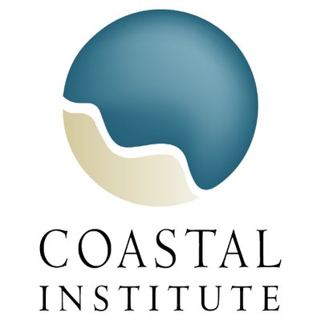

class: title-slide   

```{r setup, include=FALSE, message=FALSE}
options(htmltools.dir.version = FALSE)
```

# Nor'eastR Conference

</img>

## A one day \#rstats conference - Friday, October 26, 2018 - Providence, RI.

</img>
---

# Thank You!


.header[</img>]

.left-column[

- Committee
- Sponsors
- Volunteers
- Attendees
- URI

]

.right-column[

]

---

# Best! Host! Ever!

.header[</img>]

.left-column[

- Amber Neville
- Judith Swift
- Nicole Rohr
- Aislyne Calianos

]

.right-column[



]

---

# Speaker Gift Bags!

.header[</img>]

.left-column[

]

.right-column[


]

---

# Speaker Gift Bags: Del's

.header[</img>]

.left-column[

Dave's tweet

]

.right-column[

pic

]

---

# Speaker Gift Bags: Kenyon's Johnny Cake Meal

.header[</img>]

.left-column[

About Kenyon's and Johnny Cakes

]

.right-column[

pic

]

---

# Speaker Gift Bags: Eclipse Coffee Syrup

.header[</img>]

.left-column[

Coffee Syrup Wars

]

.right-column[

pic

]

---

# Social

.header[</img>]

.left-column[

Malted Barley!

]

.right-column[

pic

]


---

</img>

