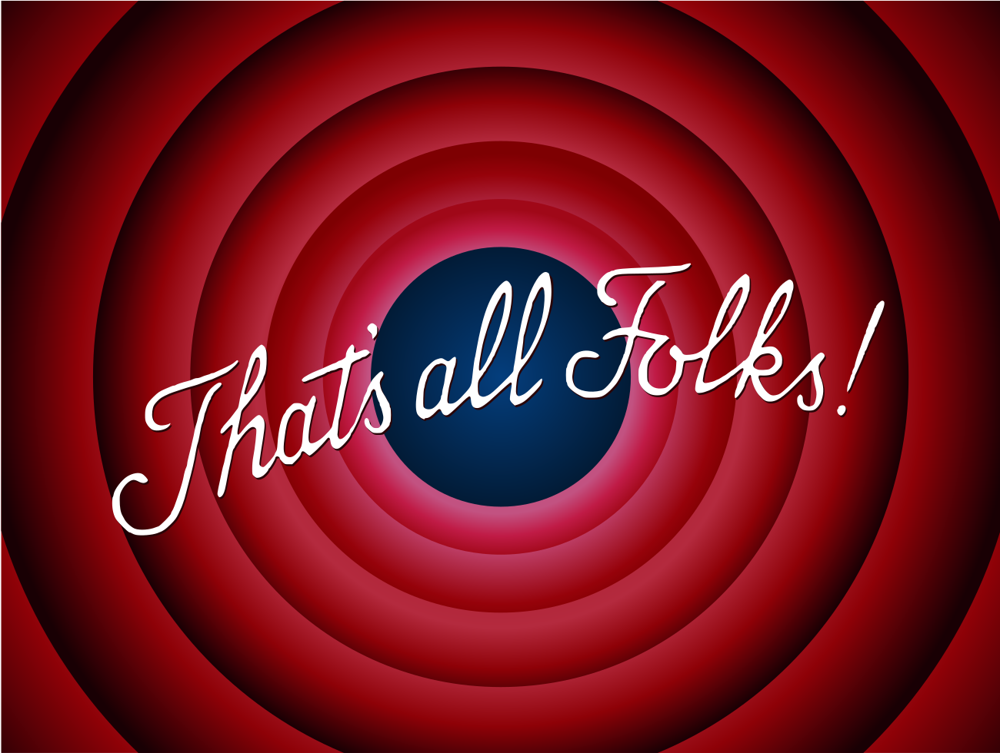

class: title-slide   

```{r setup, include=FALSE, message=FALSE}
options(htmltools.dir.version = FALSE)
```

# Nor'eastR Conference

</img>

## A one day \#rstats conference - Friday, October 26, 2018 - Providence, RI.

</img>
---
# Thank You!

.header[</img>]

.left-column-lower[

#### Committee
#### Sponsors
#### Volunteers
#### Attendees
#### URI

]

.right-column[
</img>
]
---

# Best! Host! Ever!

.header[</img>]

.left-column-lower[

#### Amber Neville
#### Judith Swift
#### Nicole Rohr
#### Aislyne Calianos

]

.right-column[

</img>

]

---

# Speaker Gift Bags!

.header[</img>]

.left-column-lower[

#### Del's

]

.right-column[

</img>

]

---
# Speaker Gift Bags!

.header[</img>]

.left-column-lower[

#### Del's
#### Eclipse Coffee Syrup

]

.right-column[

</img>

]

---
# Speaker Gift Bags!

.header[</img>]

.left-column-lower[

#### Del's
#### Eclipse Coffee Syrup
#### Kenyon's Johnnycake Mix

]

.right-column[

</img>

]

---

# Social

.header[</img>]

</img>

---

</img>

